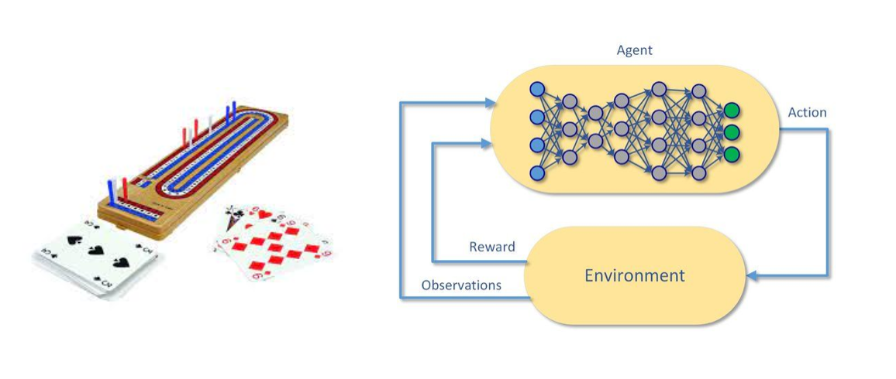

## Portfolio

---

<!-- Create list with hanckers in the page -->

### Code

[ChatbotWiz](http://github.com/Vachonni/ChatbotWiz)
Interview project categorising chats

---
[Project 2 Title](/pdf/sample_presentation.pdf)

---
[Project 3 Title](/sample_page.md)

---

### Business

- [Introduction to NLP + Bert]((pdf/IntroNLP_Bert.pdf))
  
  A brief history of NLP, embedding technics, modern models (RNN, attention, transformers, Bert) and examples of applications in finance. 
- [Project 2 Title](http://example.com/)
- [Project 3 Title](http://example.com/)
- [Project 4 Title](http://example.com/)
- [Project 5 Title](http://example.com/)

---

### Academic

- [Reinforcement Learning - DeepRL](pdf/Deep_Reinforcement_Learning__Cribbage.pdf)

  
  How about a little game of cribbage? 

  This report our deep reinforcement learning project that trained an agent to play cribbage *better* than an average human

  Realized for Doina Precup's Reinforcement Learning course at McGill University. Doina Precup is also team leader at DeepMind. 
- [Project 2 Title](http://example.com/)
- [Project 3 Title](http://example.com/)
- [Project 4 Title](http://example.com/)
- [Project 5 Title](http://example.com/)

---

Page template forked from <a href="https://github.com/evanca/quick-portfolio">evanca</a>

<!-- Remove above link if you don't want to attibute -->
