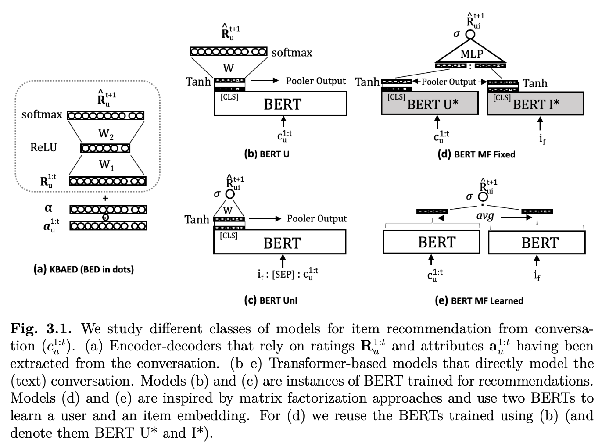

# Portfolio

<!-- Create list with hanckers in the page -->

## Code

- ### ChatbotWiz

  [GitHub Repo](http://github.com/Vachonni/ChatbotWiz)

  Rounting of chat, including topic modeling. 
  
  Developped in Docker, with Hydra for configutation. Include PyTest.

---

## Business

- ### Introduction to NLP + Bert

  [Presentation](pdf/IntroNLP_Bert.pdf)
  
  History of NLP, embedding technics, modern models (RNN, attention, transformers, Bert) and examples of applications in finance. 

- ### MLOps webinar

  [Presentation](pdf/MLOps%20webinar.pdf)

  Overview of MLOps practices applied in Azure.

---

## Academic

- ### Reinforcement Learning - DeepRL

  

  [Paper](pdf/Deep_Reinforcement_Learning__Cribbage.pdf) - [GitHub Repo](https://github.com/Vachonni/agent-cribbage)

  Deep reinforcement learning project that trained an agent to play cribbage *better* than an average human

  Realized for Doina Precup's Reinforcement Learning course at McGill University. Doina Precup is also team leader at DeepMind. 

- ### Conversational Recommendation - Listen before you talk

  

  [Paper RecSys 2020](pdf/Research%20Paper%20-%20RecSys%202020%20-%20Nicholas%20Vachon.pdf) --- [Master thesis](pdf/Master%20Thesis%20-%20Nicholas%20Vachon.pdf) --- [GitHub Repo](http://github.com/Vachonni/ReDial)

  Combination of recommender systems and conversational agents.

---

Page template forked from <a href="https://github.com/evanca/quick-portfolio">evanca</a>

<!-- Remove above link if you don't want to attibute -->
